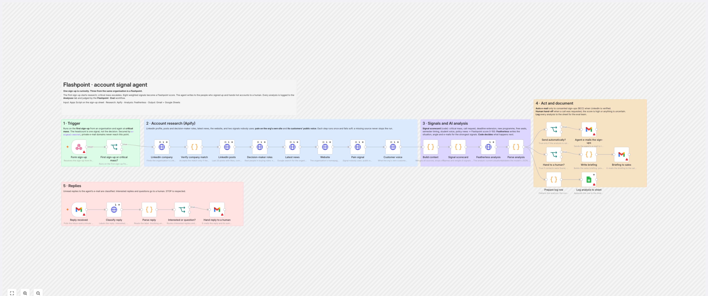
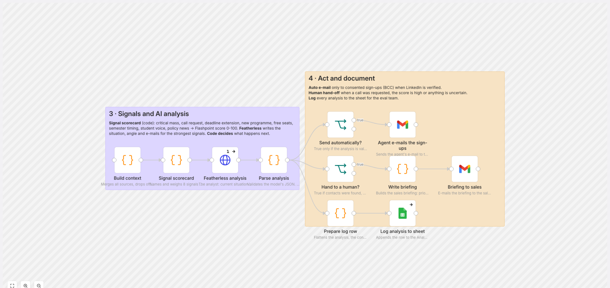
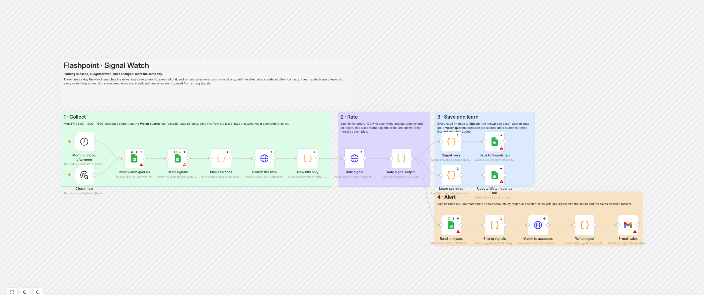
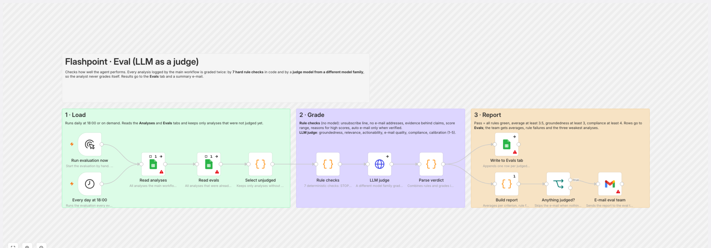

# Flashpoint

**One sign-up is curiosity. Three from the same organisation is a flashpoint.**

Flashpoint is an n8n agent that finds the moment an organisation is ready to buy. It combines a signal nobody uses, several colleagues signing up on their own, with seven more public signals. It scores them in code, writes to the people who signed up, and hands hot accounts to sales with ranked decision makers and an e-mail written for the current situation.

Built in one day at **GTM Hackathon Berlin** (3 October 2026, *"Detect the signal. Build the agent."*), presented by Co-Learning Club with **Apify** (main partner), **n8n**, **Featherless** and host **Bella&Bona**. ## Built for Kredible

[Kredible](https://getkredible.lovable.app/universities) finances the blocked account (€11,904 in 2026), tuition and first-year living costs of admitted non-EU students, so the students a university admits can actually enrol. For the university it costs nothing: no fees, no revenue share, no repayment risk.

Kredible's go-to-market question is which university to talk to, and when. A university is ready when its staff are already curious (several colleagues sign up), when it is losing admitted students right now (semester start, extended deadlines, free seats), and when its money moves (budget freezes lifted). Flashpoint watches all of that and hands Kredible's sales team the moment, the people and the message.



## Hackathon fit

| Track | What Flashpoint does |
|---|---|
| **Capture** (Apify): a signal nobody is using | Colleague clustering on a sign-up sheet, plus deadline extensions on the organisation's own website (= unfilled seats), new programmes, free places, students' public posts about funding, budget freezes and policy changes |
| **Act** (n8n): close the loop, no human in the middle | The agent e-mails the consented sign-ups by itself; sales gets a briefing; a human only steps in for calls, high scores or anything uncertain |
| **Out of the box** (Featherless): the unexpected data source that works | Signal Watch reads the news 3× a day and learns which searches work; every reply is logged and the next analysis learns which signals and angles get answers; a second model family judges every analysis |

| Judging criterion | Evidence |
|---|---|
| Originality: how fresh is the signal? | 8 named signals in a scorecard; headcount is only one of them |
| Real solution: runs today, usable on Monday | Live n8n workflows, real universities, real briefings in the sales inbox |
| Reliability: fails gracefully, holds up under GDPR | Abstains on an unverified LinkedIn match; code decides, not the model; 7 rule checks + LLM judge; consent, BCC, no cold e-mail |
| Wild card: idea, craft, ambition | Self-learning Signal Watch, generated documentation, end-to-end test harness |

## How it works

```
Lovable landing page ──► Google Sheet ──► Apps Script ──► n8n webhook
   (newsletter form)      (sign-ups)       counts per        │
                                           e-mail domain     ▼
     ┌───────────────────────────────────────────────────────────────────┐
     │ 1 Trigger      first sign-up, then again at critical mass          │
     │ 2 Research     Apify: LinkedIn company, posts, decision makers,    │
     │                news, website, deadline extensions, student voice   │
     │ 3 Signals      scorecard (code) → Flashpoint score 0-100            │
     │   + analysis   Featherless Qwen 72B: situation, angle, e-mails      │
     │ 4 Act          agent e-mail to sign-ups · sales briefing · log      │
     │ 5 Replies      classify, hand interested ones to a human, log to    │
     │                Outcomes → playbook for the next analysis           │
     └───────────────────────────────────────────────────────────────────┘
     Signal Watch (3× daily) ──► Signals tab ──► digest to sales
     Eval (daily) ──► rule checks + DeepSeek-V3 judge ──► Evals tab + report
```

### The signal scorecard

| Signal | Weight | Source |
|---|---|---|
| Colleagues signing up (critical mass) | 25 | Sign-up sheet: count and distinct roles |
| Asked for a call | 20 | Form checkbox |
| Deadline extended (unfilled seats) | 15 | The organisation's own website |
| New programme launching | 10 | News, website, LinkedIn posts |
| Seats still free | 10 | "freie Plätze", "still accepting applications" … |
| Semester timing | 10 | Computed from the date (winter 1 Oct, summer 1 Apr) |
| Students struggling to fund (public) | 5 | Reddit |
| Funding or policy news | 5 | Haushaltssperre, DAAD, Sperrkonto, visa … |

Score 60+ → hand to a human (HOT). The briefing opens with the scorecard and the current situation.

### It learns from replies

Every reply is classified (interested, question, not interested, stop) and logged to the **Outcomes** tab. Before each analysis, the **Learned playbook** node joins all replies to the analyses they answered and computes the positive-reply rate per signal and the angles that worked. The analyst receives this as *what worked before* and leans on it. The Signal Watch learns too: precision per search, dead searches retired, new searches proposed from strong signals, and sales feedback used as examples.

### What sales gets

- **Who signed up**: name, e-mail, role
- **Decision makers on LinkedIn**: name, title, profile link, ranked A/B/C by role and seniority in code
- **Outreach templates**: one per contact, written for the strongest current signal, sent personally
- **Signal digest**: 3× a day, e.g. *"Funding released in Saxony → these accounts, these contacts"*

## Workflows

| Workflow | Nodes | Screenshot |
|---|---|---|
| Main: trigger → research → signals → learn → act → replies | 31 | [overview](docs/screenshots/01-main-overview.png) · [trigger + research](docs/screenshots/02-trigger-and-research.png) · [analysis + act](docs/screenshots/03-analysis-and-act.png) · [replies](docs/screenshots/04-replies.png) · [legend](docs/screenshots/07-main-legend.png) |
| Signal Watch: 3× daily news, rating, self-learning searches | 18 | [screenshot](docs/screenshots/05-signal-watch.png) |
| Eval: rule checks + LLM as a judge | 12 | [screenshot](docs/screenshots/06-eval-llm-judge.png) |





Every prompt, API, signal query, data field and decision rule is listed in the generated reference: [`docs/flashpoint-docs.html`](docs/flashpoint-docs.html).

## Results (live runs against the deployed workflow)

| Run | Universities | Expected path | Passed eval | Groundedness | Compliance | Avg time |
|---|---|---|---|---|---|---|
| Berlin | 10 (TU, FU, HU, BHT, HTW, UdK, Charité, Hertie, HWR, ASH) | 9/10 | 5/6 | 3.5/5 | 4.8/5 | 149 s |
| Germany | 8 (TUM, LMU, RWTH, KIT, Mannheim, Dresden, Hamburg, Heidelberg) | 8/8 | 7/7 | 3.6/5 | 5.0/5 | 156 s |

Paths tested include: full buying committee, call requested, single role, domain ≠ name, wrong institution typed (correctly not verified), threshold not reached (correctly stopped). Reports: [`tests/berlin_report.html`](tests/berlin_report.html), [`tests/germany_report.html`](tests/germany_report.html).

What the eval caught: an analysis that claimed pain evidence the search had not returned, and a score of 85 without evidence (Hertie School). Off-target search hits are now dropped in code before the model sees them.

## Repository

```
n8n/
  flashpoint.py            builds and deploys all three workflows (--deploy)
  build_critical_mass.py   main workflow core + CONFIG block (product, ICP, roles, signal queries)
  watch.py                 Signal Watch workflow
  node_docs.py             one description per node: notes, legends, docs
  docs.py                  generates docs/flashpoint-docs.html
  flashpoint-*.json        importable workflows (no keys, no personal data)
  configs/                 example presets (Kredible, B2B SaaS) showing what to change per use case
google/flashpoint-sheet.gs Apps Script: form endpoint, per-domain counting, triggers, log tabs
tests/                     live test runner, evaluator, form filler (Playwright), reports
pitch/                     90-second pitch, demo video script
docs/                      reference page and workflow screenshots
ideation/                  idea evaluation with Claude, Codex, Grok and Gemini
archive/                   earlier prototypes (office-lunch idea, first Kredible version)
```

## Setup

1. **Keys** in `.env` (see `.env.example`): `N8N_BASE_URL`, `N8N_API_KEY`, `APIFY_TOKEN`, `FEATHERLESS_API_KEY`, `FEATHERLESS_MODEL`, `SALES_EMAIL`, `SALES_TEAM`, `EVAL_EMAIL`, `SIGNAL_SECRET`.
2. **Deploy**: `bash -c 'set -a; . ./.env; set +a; python3 n8n/flashpoint.py --deploy'` creates or updates the three workflows and their credentials. `TEST_MODE=1` disables the agent e-mail to sign-ups.
3. **In n8n**: connect Gmail and Google Sheets (Google sign-in), then activate.
4. **Apps Script**: paste `google/flashpoint-sheet.gs` into the sign-up sheet, set `SHEET_ID`, `N8N_WEBHOOK_URL`, `N8N_SECRET`, `THRESHOLD`, run `checkSetup` and `installTriggers`, deploy as web app for the form.
5. **Test**: `cd tests && npm install && node fill-form.js --dry`, then without `--dry`. This fills the live landing page form (verified: 6/6 sign-ups accepted, written to the sheet). Or `python3 tests/berlin_cases.py` / `tests/germany_cases.py` straight against the webhook.

**New use case**: edit the CONFIG block in `n8n/build_critical_mass.py` (product, ICP, decision roles, signal queries, e-mail brief) and the watch searches in `n8n/watch.py`, then deploy.

## Privacy

- Sign-ups give consent on the form; private e-mail domains are never grouped.
- The agent writes only to people who signed up, in BCC, with an unsubscribe line. No cold e-mail (UWG §7).
- LinkedIn decision makers go to sales only; the model sees job titles. Sales contacts them personally and states the source (GDPR Art. 14).
- Reddit usernames and e-mail addresses are removed before any model sees the text.
- Keys live in n8n credentials and Apps Script properties, never in the repo.

## Stack

Lovable · Google Sheets + Apps Script · n8n Cloud · Apify (`harvestapi/linkedin-company`, `harvestapi/linkedin-company-posts`, `harvestapi/linkedin-company-employees`, `apify/rag-web-browser`) · Featherless (Qwen2.5-72B-Instruct analyst, DeepSeek-V3 judge) · Gmail · Playwright
